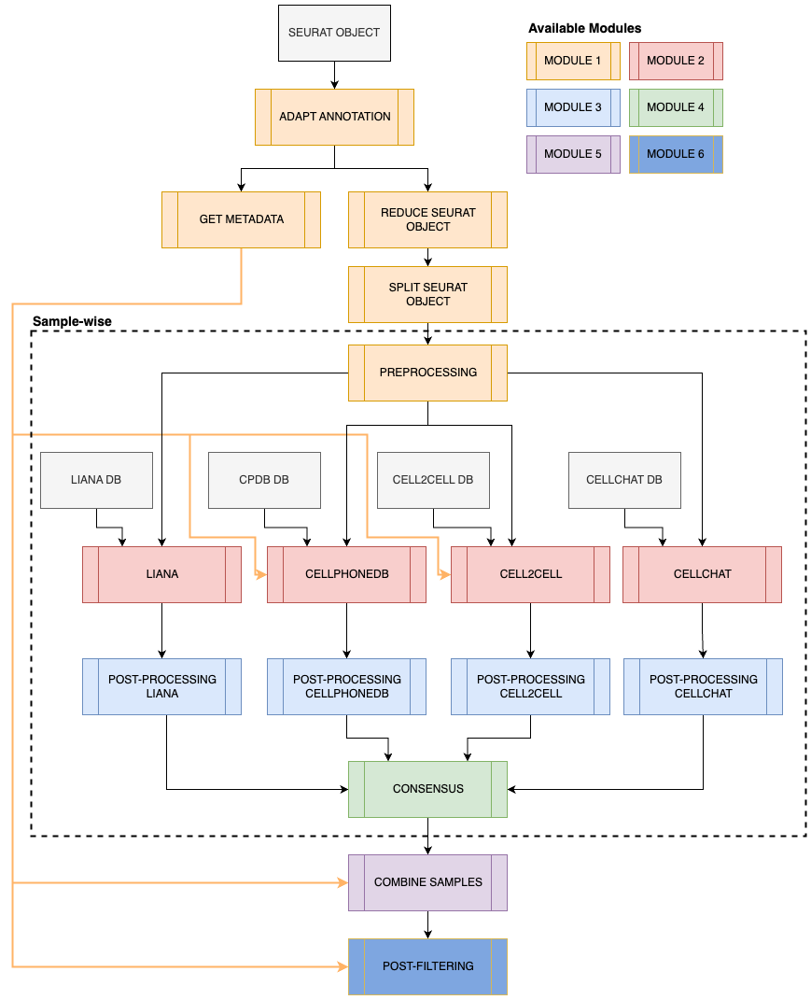

# scrnaq-cellcomm

Modular pipeline for inferring cell-cell interactions (CCIs) from scRNAseq data using multiple publicly available tools. The following tools are currently implemented: 

- LIANA (0.1.12)
- CellPhoneDB v5 (5.0.0)
- Cell2cell (0.7.3)
- CellChat v2 (2.1.1)

## Quick start

1. Fork or clone this repo
2. Setup required conda environments with `setup_env.sh`
3. Use `nf_template.sh` to run the pipeline.

## Workflow Schematic



## Prerequisites

Two separate conda environments are used to infer the CCIs with Cell2Cell and CellPhoneDB v5.

```sh
# Cell2cell - Python/202_cci_cell2cell.py
mamba env create --name cell2cell --file env/cell2cell.yml

# CellPhoneDB - Python/203_cci_cpdb.py
mamba env create --name cpdb --file env/cpdb.yml
```

All other scripts can be used with the following environment:

```sh
mamba env create --name cci --file env/cci.yml
```

After creating this environment, please install the following R packages manually using `devtools` (or your preferred package installer, e.g. `pak` or `pacman`):
```R
# Visualization
devtools::install_github("jmw86069/colorjam")

# CellChat (order is important, presto necessary because of bug w/ CellChat installation)
devtools::install_github("immunogenomics/presto")
devtools::install_github("jinworks/CellChat")

# LIANA
devtools::install_github("saezlab/liana")
```

Alternatively, use the `setup_env.sh` to setup all required environments with a single bash script.

## Running the Nextflow pipeline

> Make sure you have Nextflow set up as described here [Confluence](https://gaitilab.atlassian.net/wiki/spaces/GAITILAB/pages/3211272/Running+cellranger+and+split-pipe+scRNA-seq+processing+pipelines+in+Nextflow#Nextflow-executable) (only accessible internally) or see the official Nextflow page for the [installation instructions](https://www.nextflow.io/docs/latest/getstarted.html#installation).

The repository contains the file [nf_template.sh](nf_template.sh) which can be used to run the pipeline. In this file, please set up your own paths etc. After changing this file, you can run the pipeline on the cluster, you can run the following:

```sh
sbatch nf_template.sh
```

The actual pipeline can be executed with the following:

```sh
nextflow run ${project_dir} -with-report -with-trace \
    -profile ${nf_profile} \
    -w ${work_dir} \
    --input_file $input_file
```

A more elaborate command can be found in [nf_template.sh](nf_template.sh).

Nextflow configuration files can be found in folder [nf-config](nf_config), with two symlinks: `metrics_and_report.config` and `process_resources.config`, these point to two files on H4H. These files do not have to be changed.

> The Nextflow pipeline uses the three conda environments, and uses as path `$HOME/miniforge3/envs/{env_name}`. These are specified in [configuration_profiles](nf-config/configuration_profiles) and [process_info](nf-config/process_info). In the latter, the two environments `cpdb` and `cell2cell` are used for the processes: `INFER_CPDB` and `INFER_CELL2CELL`, respectively. If necessary, feel free to change.

## INPUTS

### Input files

One of the following arguments has to be supplied to run the pipeline.

- `input_file`, if supplied, you can start with Module 1.
- `sample_dir`, if supplied, you can start with Module 1 or 2. For the latter, it is expected that this folder has two subfolders ('mtx' and 'seurat'). See below for further details.

Other optional arguments are:

- `split_varname`: variable name to be used to split the Seurat object, e.g. variable name for the samples (Module 1: SPLIT_SEURAT_OBJECT). By default: Sample
- `annot`: column in Seurat object to be used as cell type labels.
- `min_cells`: min. number of cells required for a cell type to be kept in a sample (Module 1: PREPROCESSING). By default 100.
- `min_cell_types`: min. number of cell types in a sample, for a sample to be used for inferring CCIs. At least two cell types are required to infer interactions (Module 1: PREPROCESSING). By default 2. 
- `min_pct`: min. pct of cells expressing a gene for (Module 2: CELLPHONEDB), by default 0.1 (10%)
- `alpha`: significance threshold for consensus (Module 4), by default 0.05
- `n_perm`: number of permutations (Module 2), by default 1000.
- `min_frac_samples`: detected in at least M% of the samples (Module 6), by default 0.5

### Interactions Database

To infer CCIs, a database with interactions is required. The multiple tools require differently formatted databases, therefore a custom database has been generated. The main database has already been formatted accordingly so that it can be used for the different tools. The files can be found in [data/interactions_db_v2](data/interactions_db_v2). The database contains close to 7K interactions. 

The database is constructed using the following existing databases:

- LIANA: Consensus + Ramilowski 2015
- CellPhoneDB v5
- CellChat v2

The final database files are generated using a number of scripts (R scripts starting with 010 to 017 and the Python file starting with 017), which are included in the repo.

> NOTE: By unifying these different databases, some of the interactions may be lost due to formatting.

Alternatively, you can create your own database, with the aforementioned files. Detailed documentation for this will be added in the **future**.

### Workflow options

The pipeline is set up to be as modular as possible. Generally, this modularity can be controlled with the parameter `approach`, which can be a value between **1-6**. They do the following:

1. Pre-processing (Module 1)
2. Inferring interactions (Module 2)
3. Post-processing (Module 3)
4. Consensus (Module 4)
5. Combining samples (Module 5)
6. Post-filtering (Module 6)

> **NOTE: currently all steps before the value of approach are executed, e.g if `approach` = 3, then Modules 1-3 are executed, unless one of the skip and do arguments are set, which are described below.**.

> As this pipeline is initially setup for the GBM project, not all steps can be used for other cases. Therefore, the setting `approach` can be only a value between 1 and 5, **default = 5**.  

In addition, there are processes within these main modules that can be executed or skipped, namely:

- `do_annot`: skip (re)annotation of the Seurat object.
- `skip_reduction`: skip reducing the Seurat object size.
- `skip_preprocessing`: skip pre-processing of the individual sample Seurat objects. If you skip the pre-processing, you have to give the argument `sample_dir` which should contain two folders: 'seurat' and 'mtx'. The seurat folder should contain Rds files, one for each sample. The mtx folder should contain subfolders for each sample, where each subfolder should contain the following files: 'barcodes.tsv', 'genes.tsv' and 'matrix.mtx'.

These three options are **by default `false`** If you want to skip (one of) these steps, then add the argument to the bash command, e.g. add `-do_annot`.

## Running individual scripts

All scripts can be run individually, you can run in through the command line, some example scripts are available in the folder [jobs](jobs).

### Python scripts

There are three Python scripts available in the [Python](Python) folder:
- [Python/017_update_cellphonedby.py](Python/017_update_cellphonedby.py)
- [Python/203_cci_cpdb.py](Python/203_cci_cpdb.py)
- [Python/202_cci_cell2cell.py](Python/202_cci_cell2cell.py)

> Note: Make sure to run the CellPhoneDB related scripts (the first two) in the **cpdb** conda environment, while the latter can has to be run in the **cell2cell** environment.

You can run these scripts directly in Python by uncommenting a section in the Python file. Please do not forget to change the arguments for your use case. See example below:

```Python
if __name__ == "__main__":
    parser = argparse.ArgumentParser(
        description="Infer CCIs with CellPhoneDB v5")

    # Parse arguments
    # Always required
    parser.add_argument("-o", "--output_dir", type=str,
                        default="output", help="Output directory")
    parser.add_argument("-m", "--meta", type=str, help="Path to metadata file")
    args = parser.parse_args()

    # TODO: if run from Python, please uncomment the following lines
    args.output_dir = "project_dir/output"
    args.meta = "project_dir/data/meta.csv"

    main(args)

```

### Rscripts

All R scripts can be found in the folder [scripts](scripts). These files can be run interactively by changing the arguments in the `else { }` section, see the example below.

```R
if (!interactive()) {
    # Define input arguments when running from bash
    parser <- setup_default_argparser(
        description = "Post-processing LIANA results",
    )
    parser$add_argument("--input_interactions", type = "character", default = NULL, help = "Path to LIANA results")
    args <- parser$parse_args()
} else {
    # Provide arguments here for local runs
    args <- list()
    args$log_level <- 5
    args$output_dir <- glue("{here::here()}/output/test/")
    args$input_interactions <- "data/input_dir"
}
```

## References

| Tool | Reference |
|---|---|
| [LIANA](https://github.com/saezlab/liana/) | Dimitrov, D., Türei, D., Garrido-Rodriguez M., Burmedi P.L., Nagai, J.S., Boys, C., Flores, R.O.R., Kim, H., Szalai, B., Costa, I.G., Valdeolivas, A., Dugourd, A. and Saez-Rodriguez, J. Comparison of methods and resources for cell-cell communication inference from single-cell RNA-Seq data. Nat Commun 13, 3224 (2022). [https://doi.org/10.1038/s41467-022-30755-0](https://doi.org/10.1038/s41467-022-30755-0)|
| [CellPhoneDB v5](https://github.com/ventolab/CellphoneDB) | Garcia-Alonso, L., Lorenzi, V., Mazzeo, C.I. et al. Single-cell roadmap of human gonadal development. Nature 607, 540–547 (2022). [https://doi.org/10.1038/s41586-022-04918-4](https://doi.org/10.1038/s41586-022-04918-4) |
| [cell2cell](https://github.com/earmingol/cell2cell) | Armingol E, Ghaddar A, Joshi CJ, Baghdassarian H, Shamie I, et al. (2022) Inferring a spatial code of cell-cell interactions across a whole animal body. PLOS Computational Biology 18(11): e1010715. [https://doi.org/10.1371/journal.pcbi.1010715](https://doi.org/10.1371/journal.pcbi.1010715) |
| [CellChat v2](https://github.com/jinworks/CellChat) | Jin, S., Plikus, M. V., & Nie, Q. (2023). CellChat for systematic analysis of cell-cell communication from single-cell and spatially resolved transcriptomics (p. 2023.11.05.565674). bioRxiv. [https://doi.org/10.1101/2023.11.05.565674](https://doi.org/10.1101/2023.11.05.565674) |

### Other

Türei, D., Valdeolivas, A., Gul, L., Palacio‐Escat, N., Klein, M., Ivanova, O., Ölbei, M., Gábor, A., Theis, F., Módos, D. and Korcsmáros, T., 2021. Integrated intra‐and intercellular signaling knowledge for multicellular omics analysis. Molecular systems biology, 17(3), p.e9923. https://doi.org/10.15252/msb.20209923

P. Di Tommaso, et al. Nextflow enables reproducible computational workflows. Nature Biotechnology 35, 316–319 (2017) doi:10.1038/nbt.3820
