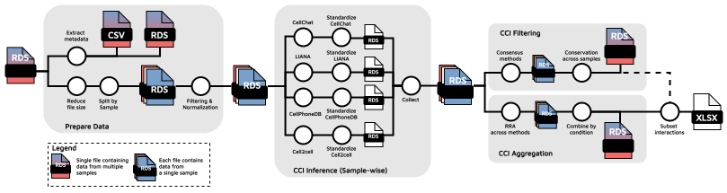

# scrnaq-cellcomm

Modular pipeline for inferring cell-cell interactions (CCIs) from scRNAseq data using multiple publicly available tools. The following tools are currently implemented:

* LIANA (0.1.12)
* CellPhoneDB v5 (5.0.0)
* Cell2cell (0.7.3)
* CellChat v2 (2.1.1)

## Quick start

1. Fork this repo (then clone)
2. Installing [Nextflow](https://github.com/nextflow-io/nextflow/releases/download/v23.04.3/nextflow-23.04.3-all), used version for testing: 23.04.3
3. Setup required conda environments with `cd env && setup_env.sh`
4. Use `nf_template.sh` to run the pipeline.

## Workflow

> Please note that only the main outputs are shown in the workflow. For each step, intermediate results are generated as well.  

1. **Prepare Data.** Prepare the Seurat object with the scRNAseq data for inference.
2. **CCI Inference.** Per-sample
   
   a. Inference. Run tools with given user parameters.
   
   b. Standardize. Format CCI results for each tool.

   c. Collect into a single file. Combine the results for all tools into one file.

3. **CCI Filtering & Merging.** 
    > NOTE: with the continuous approach, no information (interactions) are lost.

    a. **Binary approach**

   - **Sample-wise.** Keep only significant interactions (p < 0.05) in at least LIANA and 2 other tools, this is done for each unique 'interaction' - 'cell type pair' combination.
   - **Conservation across samples.** Keep only interactions that are found in at least N samples (or patients, in case sample = patient) for each condition level.

    
    b. **Continuous approach**

    - **Robust Rank Aggregation (RRA) across methods.** Rank the interactions (each unique 'interaction' - 'cell type pair' combination) based on all tools using the Robust Rank Aggregation method (also used in LIANA). The obtained ranks can be interpreted as p-values. **(sample-wise)**
    - **Combine interactions by condition.** Summarize interactions by condition, using Fisher combine for the ranks obtained with 3b and averaging the interaction scores for CellPhoneDB, CellChat & LIANA. 
    
    c. **Merge.** Use left-join to merge the results from approach 3a with 3b, i.e. adding a p-value and scores for each interaction in 3a. An Excel file with these results is generated. 

### Parameter Configuration

The pipeline contains various parameters that can be set. These can be found in [nf_template.sh](nf_template.sh) or in [nextflow.config](nextflow.config). The latter contains also the default values. 

<!-- The pipeline contains several modules, consequently you can start the pipeline from each module. These modules correspond to the three main steps described in Workflow.  -->

Required inputs:

* `input_file`. This is your Seurat object (RDS file) with the scRNAseq data for your cohort.
* `split_varname` (default="Sample")
* `condition` (default="").  Used for **CCI Filtering & Merging** for comparison of multiple conditions (or groups).
* `Patient` (default=""). In case a patient has multiple samples, if not set then the following assumption is made Patient=Sample.

### Interactions Database

To infer CCIs, a database with interactions is required. The multiple tools require differently formatted databases, therefore a custom database has been generated. The main database has already been formatted accordingly so that it can be used for the different tools. The files can be found in [data/interactions_db](data/interactions_db). The database contains close to 7K interactions.
To infer CCIs, a database with interactions is required. The multiple tools require differently formatted databases, therefore a custom database has been generated. The main database has already been formatted accordingly so that it can be used for the different tools. The files can be found in [data/interactions_db](data/interactions_db). The database contains close to 7K interactions.

The database is constructed using the following existing databases:

* LIANA: Consensus + Ramilowski 2015
* CellPhoneDB v5
* CellChat v2

> NOTE: By unifying these different databases, some of the interactions may be lost due to formatting.

## References

| Tool | Reference |
|---|---|
| [LIANA](https://github.com/saezlab/liana/) | Dimitrov, D., Türei, D., Garrido-Rodriguez M., Burmedi P. L., Nagai, J. S., Boys, C., Flores, R. O. R., Kim, H., Szalai, B., Costa, I. G., Valdeolivas, A., Dugourd, A. and Saez-Rodriguez, J. Comparison of methods and resources for cell-cell communication inference from single-cell RNA-Seq data. Nat Commun 13, 3224 (2022). [https://doi.org/10.1038/s41467-022-30755-0](https://doi.org/10.1038/s41467-022-30755-0)|
| [CellPhoneDB v5](https://github.com/ventolab/CellphoneDB) | Garcia-Alonso, L., Lorenzi, V., Mazzeo, C. I. et al. Single-cell roadmap of human gonadal development. Nature 607, 540–547 (2022). [https://doi.org/10.1038/s41586-022-04918-4](https://doi.org/10.1038/s41586-022-04918-4) |
| [cell2cell](https://github.com/earmingol/cell2cell) | Armingol E, Ghaddar A, Joshi CJ, Baghdassarian H, Shamie I, et al. (2022) Inferring a spatial code of cell-cell interactions across a whole animal body. PLOS Computational Biology 18(11): e1010715. [https://doi.org/10.1371/journal.pcbi.1010715](https://doi.org/10.1371/journal.pcbi.1010715) |
| [CellChat v2](https://github.com/jinworks/CellChat) | Jin, S., Plikus, M. V., & Nie, Q. (2023). CellChat for systematic analysis of cell-cell communication from single-cell and spatially resolved transcriptomics (p. 2023.11.05.565674). bioRxiv. [https://doi.org/10.1101/2023.11.05.565674](https://doi.org/10.1101/2023.11.05.565674) |

### Other

Türei, D., Valdeolivas, A., Gul, L., Palacio‐Escat, N., Klein, M., Ivanova, O., Ölbei, M., Gábor, A., Theis, F., Módos, D. and Korcsmáros, T., 2021. Integrated intra‐and intercellular signaling knowledge for multicellular omics analysis. Molecular systems biology, 17(3), p.e9923. https://doi.org/10.15252/msb.20209923

P. Di Tommaso, et al. Nextflow enables reproducible computational workflows. Nature Biotechnology 35, 316–319 (2017) doi:10.1038/nbt.3820
