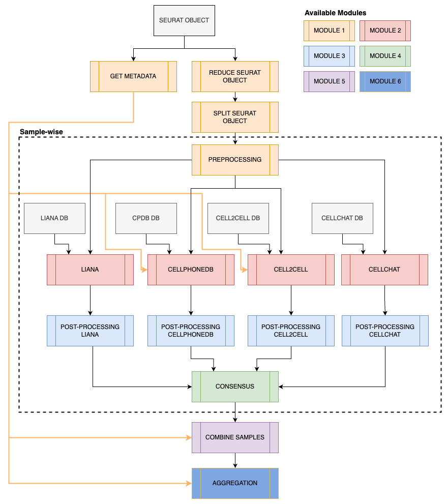

# scrnaq-cellcomm

Modular pipeline for inferring cell-cell interactions (CCIs) from scRNAseq data using multiple publicly available tools. The following tools are currently implemented: 

* LIANA (0.1.12)
* CellPhoneDB v5 (5.0.0)
* Cell2cell (0.7.3)
* CellChat v2 (2.1.1)

## Quick start

1. Fork this repo (then clone)
2. Installing [Nextflow](https://github.com/nextflow-io/nextflow/releases/download/v23.04.3/nextflow-23.04.3-all), used version for testing: 23.04.3
3. Setup required conda environments with `cd env && setup_env.sh`
4. Use `nf_template.sh` to run the pipeline.

## Workflow

Modules 

1. **Preparing the data**. Pre-filtering and pre-processing of the gene expression data. 
2. **Inference of CCIs**. Using the gene-expression matrix infer the CCIs using four publicly available tools (LIANA, CellPhoneDB, Cell2cell and CellChat). 
3. **Post-processing CCIs**. Formatting the CCI results in predefined format for outputs of each tool.
4. **Consensus across methods**. Filtering interactions based on significance level and detection in multiple tools. This is done for each individual sample.
5. **Recurrence/conservation across samples**. Filtering interactions based on detection in multiple samples.

The pipeline is setup up modular, so you can start the pipeline from any of the five modules. 

### Parameters
All default parameters can be found in [nextflow.config](nextflow.config).

Below the required parameters for each of the five modules as described above. 

Module 1.
- `input_file`. Seurat object containing your scRNAseq data. 
- `annot`. Variable in Seurat object's metadata containing the cell type labels.
- `min_cells`. Min. number of cells that a cell type group should have to be included, default = .
- `split_varname`. Variable in Seurat object's containing the sample ID. 
- `min_cell_types` 

### Interactions Database

To infer CCIs, a database with interactions is required. The multiple tools require differently formatted databases, therefore a custom database has been generated. The main database has already been formatted accordingly so that it can be used for the different tools. The files can be found in [data/interactions_db](data/interactions_db). The database contains close to 7K interactions.

The database is constructed using the following existing databases:

* LIANA: Consensus + Ramilowski 2015
* CellPhoneDB v5
* CellChat v2

## References

| Tool | Reference |
|---|---|
| [LIANA](https://github.com/saezlab/liana/) | Dimitrov, D., Türei, D., Garrido-Rodriguez M., Burmedi P. L., Nagai, J. S., Boys, C., Flores, R. O. R., Kim, H., Szalai, B., Costa, I. G., Valdeolivas, A., Dugourd, A. and Saez-Rodriguez, J. Comparison of methods and resources for cell-cell communication inference from single-cell RNA-Seq data. Nat Commun 13, 3224 (2022). [https://doi.org/10.1038/s41467-022-30755-0](https://doi.org/10.1038/s41467-022-30755-0)|
| [CellPhoneDB v5](https://github.com/ventolab/CellphoneDB) | Garcia-Alonso, L., Lorenzi, V., Mazzeo, C. I. et al. Single-cell roadmap of human gonadal development. Nature 607, 540–547 (2022). [https://doi.org/10.1038/s41586-022-04918-4](https://doi.org/10.1038/s41586-022-04918-4) |
| [cell2cell](https://github.com/earmingol/cell2cell) | Armingol E, Ghaddar A, Joshi CJ, Baghdassarian H, Shamie I, et al. (2022) Inferring a spatial code of cell-cell interactions across a whole animal body. PLOS Computational Biology 18(11): e1010715. [https://doi.org/10.1371/journal.pcbi.1010715](https://doi.org/10.1371/journal.pcbi.1010715) |
| [CellChat v2](https://github.com/jinworks/CellChat) | Jin, S., Plikus, M. V., & Nie, Q. (2023). CellChat for systematic analysis of cell-cell communication from single-cell and spatially resolved transcriptomics (p. 2023.11.05.565674). bioRxiv. [https://doi.org/10.1101/2023.11.05.565674](https://doi.org/10.1101/2023.11.05.565674) |

### Other

Türei, D., Valdeolivas, A., Gul, L., Palacio‐Escat, N., Klein, M., Ivanova, O., Ölbei, M., Gábor, A., Theis, F., Módos, D. and Korcsmáros, T., 2021. Integrated intra‐and intercellular signaling knowledge for multicellular omics analysis. Molecular systems biology, 17(3), p.e9923. https://doi.org/10.15252/msb.20209923

P. Di Tommaso, et al. Nextflow enables reproducible computational workflows. Nature Biotechnology 35, 316–319 (2017) doi:10.1038/nbt.3820
