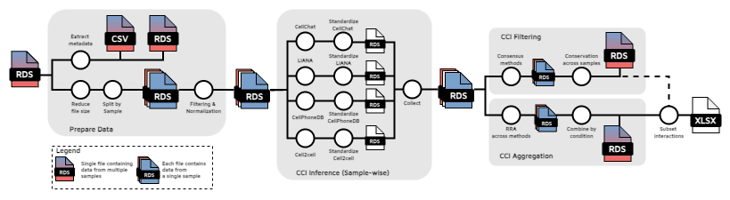
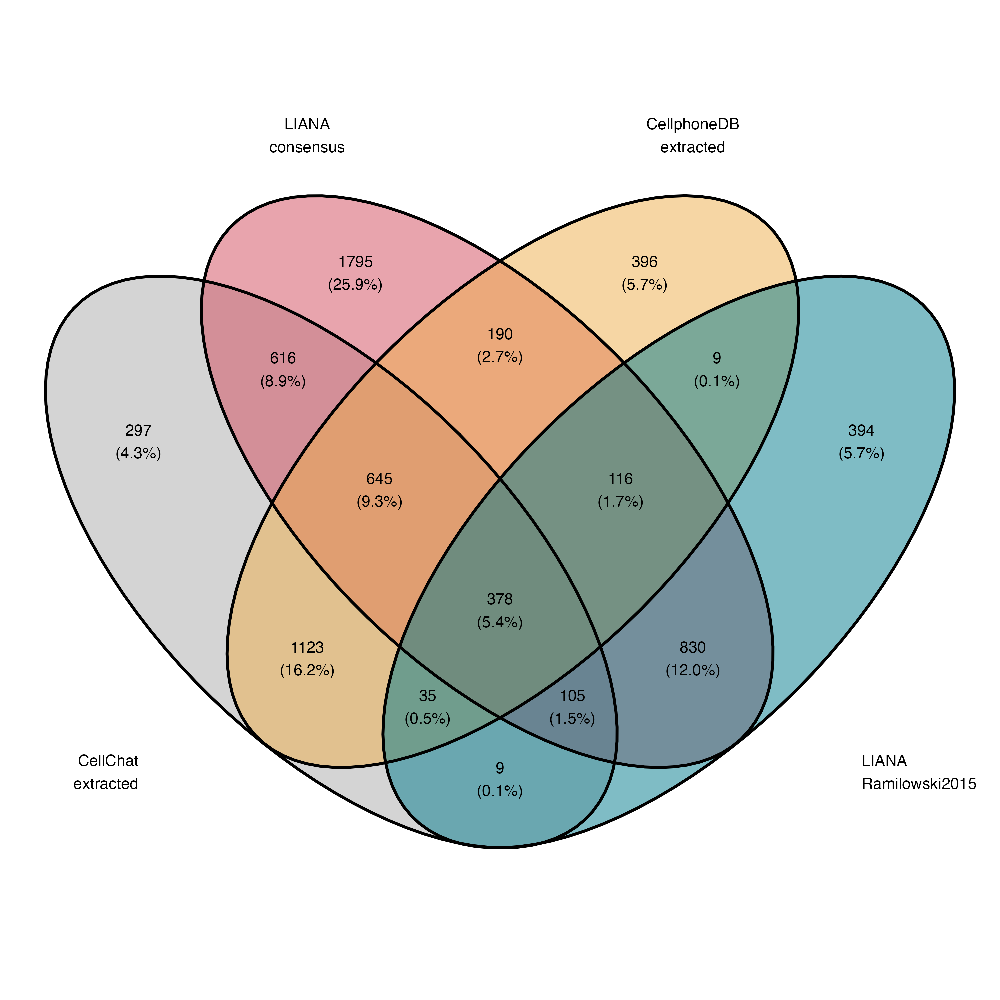

# scrnaq-cellcomm-pipeline

Pipeline for inferring cell-cell interactions (CCIs) from scRNAseq data using multiple publicly available tools. The following tools are currently implemented:

* LIANA (0.1.12)
* CellPhoneDB v5 (5.0.0)
* Cell2cell (0.7.3)
* CellChat v2 (2.1.1)

## Requirements

* Unix-like operating system (Linux, macOS, etc)
* Java 18
* Nextflow 23.04.3

> Disclaimer: pipeline has been only been tested the abovementioned versions.

## Quick start

1. Fork this repo (then clone)
2. Installing [Nextflow](https://github.com/nextflow-io/nextflow/releases/download/v23.04.3/nextflow-23.04.3-all).
3. Setup the required conda environments with `cd env && setup_env.sh`
4. Use `nf_template.sh` to run the pipeline.

## Workflow



> Please note that only the main outputs are shown in the workflow. For each step, intermediate results are generated as well.

1. **Prepare Data.** Prepare the Seurat object with the scRNAseq data for inference.
   
    - Filtering out cell types that have less than `min_cells` cells.  (default=100)
    - Normalize data using Seurat's  `NormalizeData`. 

2. **CCI Inference.** Per-sample
    

    1. Inference. Run tools with given user-specified parameters.
    2. Standardize. Format CCI results for each tool.
    3. Collect into a single file. Combine the results for all tools into one file.

3. **CCI Filtering.**

   * **Consensus across methods.** Keep only significant interactions (p < 0.05) detected in at least LIANA and 2 other tools, this is done for each unique 'interaction' - 'cell type pair' combination. **(sample-wise)**
   * **Conservation across samples.** Keep only interactions that are found in at least N (default=2) samples (or patients, in case sample=patient) for each condition level.

4. **CCI Aggregation.**
    - **Robust Rank Aggregation (RRA) across methods.** Rank the interactions (outputs of the tools), using RRA  **(sample-wise)**. 
  
      1. LIANA is split into the outputs of the individually implemented tools (connectome, logfc, NATMI, SCA and Cytotalk). 
      2. Ranking the interactions in each tool. For CellChat, CellPhoneDB and Cell2Cell this was done based on -log10(p-val) x interaction score. For the tools implemented in LIANA, the rankings were already provided.
      3. The ranked interactions are used to create a rankmatrix, where missing values are replaced with the max. rank. Then the ranks are scaled to a (0, 1) range.  
      4. The rankmatrix is used as input for the `aggregateRanks` a function implemented in R-package `RobustRankAggreg`, returning a single ranking of the interactions as p-values.

    - **Combine interactions by condition (group).** Summarize interactions by condition (group), using Fisher's  test to combine p-values as implemented in R-package `survcomp` and averaging the interaction scores for CellPhoneDB, CellChat Ce2llCell & LIANA (SCA score). Finally, the p-values are adjusted using BH. 

5. **Final filtering step.** The remaining list of interactions from module 3 can be further filtered by removing the interactions from module 4 that are insignificant (p-adj >= 0.05).

### Parameter Configuration

The pipeline contains various parameters that can be set. These can be found in [nf_template.sh](nf_template.sh) or in [nextflow.config](nextflow.config). The latter contains also the default values.

<!-- The pipeline contains several modules, consequently you can start the pipeline from each module. These modules correspond to the three main steps described in Workflow.  -->

Required inputs:

* `input_file` This is your (integrated) Seurat object (RDS file) with the scRNAseq data for your cohort.
* `sample_var` (default="Sample")
* `Patient` (default="Patient"). In case a patient has multiple samples, if not set then the following assumption is made Patient=Sample.
* `condition` (default="Condition_dummy"). Used for **3. CCI Filtering & 4. CCI Aggregation** for comparison of multiple conditions (or groups). If there is no 'condition' for your dataset, use the default. Then aggregation/filtering will be done based on Patient (or Sample, in case Patient = Sample).
* `annot` Variable in metadata with your cell type labels.
* `min_cells` (default = 100) Minimum number of cells required in each cell group for cell-cell communication
* `min_pct` (default = 0.10 = 10%) Minimum percentage of cells expressing a gene
* `n_perm` (default = 1000) Number of iterations for permutation testing
* `min_patients` Minimum number of patients for an interaction to be kept (used in **3. CCI Filtering**)
* `alpha` (default = 0.05) threshold used for **3. CCI Filtering**
* `output_dir` directory for saving output files.

### Outputs

Example of created output files for a Seurat object containing 6 samples, where one sample 'Sample 1' does not have at least two cell types with the min. number of cells. Therefore in no CCI results for 'Sample 1'.

```{shell}
output
├── 000_data
│   ├── example_data__metadata.csv
│   ├── example_data__metadata.rds
│   ├── example_data_reduced_size.rds
│   └── split_by_Sample
│       ├── Sample_1.rds
│       ├── Sample_2.rds
│       ├── Sample_3.rds
│       ├── Sample_4.rds
│       ├── Sample_5.rds
│       └── Sample_6.rds
├── 100_preprocessing
│   ├── mtx
│   │   ├── Sample_1
│   │   │   ├── barcodes.tsv
│   │   │   ├── genes.tsv
│   │   │   └── matrix.mtx
│   │   ├── Sample_2
│   │   │   ├── barcodes.tsv
│   │   │   ├── genes.tsv
│   │   │   └── matrix.mtx
│   │   ├── Sample_3
│   │   │   ├── barcodes.tsv
│   │   │   ├── genes.tsv
│   │   │   └── matrix.mtx
│   │   ├── Sample_4
│   │   │   ├── barcodes.tsv
│   │   │   ├── genes.tsv
│   │   │   └── matrix.mtx
│   │   ├── Sample_5
│   │   │   ├── barcodes.tsv
│   │   │   ├── genes.tsv
│   │   │   └── matrix.mtx
│   │   └── Sample_6
│   │       ├── barcodes.tsv
│   │       ├── genes.tsv
│   │       └── matrix.mtx
│   └── seurat
│       ├── Sample_1.rds
│       ├── Sample_2.rds
│       ├── Sample_3.rds
│       ├── Sample_4.rds
│       ├── Sample_5.rds
│       └── Sample_6.rds
├── 200_cci_cellchat
│   ├── cellchat__Sample_2.rds
│   ├── cellchat__Sample_2__raw_obj.rds
│   ├── cellchat__Sample_3.rds
│   ├── cellchat__Sample_3__raw_obj.rds
│   ├── cellchat__Sample_4.rds
│   ├── cellchat__Sample_4__raw_obj.rds
│   ├── cellchat__Sample_5.rds
│   ├── cellchat__Sample_5__raw_obj.rds
│   ├── cellchat__Sample_6.rds
│   └── cellchat__Sample_6__raw_obj.rds
├── 201_cci_liana
│   ├── liana__Sample_2.rds
│   ├── liana__Sample_3.rds
│   ├── liana__Sample_4.rds
│   ├── liana__Sample_5.rds
│   └── liana__Sample_6.rds
├── 202_cci_cell2cell
│   ├── cell2cell__Sample_2__interaction_scores.csv
│   ├── cell2cell__Sample_2__pvalues.csv
│   ├── cell2cell__Sample_2.pickle
│   ├── cell2cell__Sample_3__interaction_scores.csv
│   ├── cell2cell__Sample_3__pvalues.csv
│   ├── cell2cell__Sample_3.pickle
│   ├── cell2cell__Sample_4__interaction_scores.csv
│   ├── cell2cell__Sample_4__pvalues.csv
│   ├── cell2cell__Sample_4.pickle
│   ├── cell2cell__Sample_5__interaction_scores.csv
│   ├── cell2cell__Sample_5__pvalues.csv
│   ├── cell2cell__Sample_5.pickle
│   ├── cell2cell__Sample_6__interaction_scores.csv
│   ├── cell2cell__Sample_6__pvalues.csv
│   └── cell2cell__Sample_6.pickle
├── 203_cci_cpdb
│   ├── Sample_2_counts.h5ad
│   ├── Sample_2_metadata.tsv
│   ├── Sample_3_counts.h5ad
│   ├── Sample_3_metadata.tsv
│   ├── Sample_4_counts.h5ad
│   ├── Sample_4_metadata.tsv
│   ├── Sample_5_counts.h5ad
│   ├── Sample_5_metadata.tsv
│   ├── Sample_6_counts.h5ad
│   ├── Sample_6_metadata.tsv
│   ├── statistical_analysis_deconvoluted__Sample_2.txt
│   ├── statistical_analysis_deconvoluted__Sample_3.txt
│   ├── statistical_analysis_deconvoluted__Sample_4.txt
│   ├── statistical_analysis_deconvoluted__Sample_5.txt
│   ├── statistical_analysis_deconvoluted__Sample_6.txt
│   ├── statistical_analysis_deconvoluted_percents__Sample_2.txt
│   ├── statistical_analysis_deconvoluted_percents__Sample_3.txt
│   ├── statistical_analysis_deconvoluted_percents__Sample_4.txt
│   ├── statistical_analysis_deconvoluted_percents__Sample_5.txt
│   ├── statistical_analysis_deconvoluted_percents__Sample_6.txt
│   ├── statistical_analysis_interaction_scores__Sample_2.txt
│   ├── statistical_analysis_interaction_scores__Sample_3.txt
│   ├── statistical_analysis_interaction_scores__Sample_4.txt
│   ├── statistical_analysis_interaction_scores__Sample_5.txt
│   ├── statistical_analysis_interaction_scores__Sample_6.txt
│   ├── statistical_analysis_means__Sample_2.txt
│   ├── statistical_analysis_means__Sample_3.txt
│   ├── statistical_analysis_means__Sample_4.txt
│   ├── statistical_analysis_means__Sample_5.txt
│   ├── statistical_analysis_means__Sample_6.txt
│   ├── statistical_analysis_pvalues__Sample_2.txt
│   ├── statistical_analysis_pvalues__Sample_3.txt
│   ├── statistical_analysis_pvalues__Sample_4.txt
│   ├── statistical_analysis_pvalues__Sample_5.txt
│   ├── statistical_analysis_pvalues__Sample_6.txt
│   ├── statistical_analysis_significant_means__Sample_2.txt
│   ├── statistical_analysis_significant_means__Sample_3.txt
│   ├── statistical_analysis_significant_means__Sample_4.txt
│   ├── statistical_analysis_significant_means__Sample_5.txt
│   └── statistical_analysis_significant_means__Sample_6.txt
├── 300_postproc_cellchat
│   ├── cellchat__Sample_2__postproc.rds
│   ├── cellchat__Sample_3__postproc.rds
│   ├── cellchat__Sample_4__postproc.rds
│   ├── cellchat__Sample_5__postproc.rds
│   └── cellchat__Sample_6__postproc.rds
├── 301_postproc_liana
│   ├── liana__Sample_2__postproc.rds
│   ├── liana__Sample_3__postproc.rds
│   ├── liana__Sample_4__postproc.rds
│   ├── liana__Sample_5__postproc.rds
│   └── liana__Sample_6__postproc.rds
├── 302_postproc_cell2cell
│   ├── cell2cell__Sample_2__postproc.rds
│   ├── cell2cell__Sample_3__postproc.rds
│   ├── cell2cell__Sample_4__postproc.rds
│   ├── cell2cell__Sample_5__postproc.rds
│   └── cell2cell__Sample_6__postproc.rds
├── 303_postproc_cpdb
│   ├── cpdb__Sample_2__postproc.rds
│   ├── cpdb__Sample_3__postproc.rds
│   ├── cpdb__Sample_4__postproc.rds
│   ├── cpdb__Sample_5__postproc.rds
│   └── cpdb__Sample_6__postproc.rds
├── 400_consensus_and_RRA
│   ├── Sample_2__interactions_agg_rank.rds
│   ├── Sample_2__interactions_mvoted.rds
│   ├── Sample_2__signif_interactions.rds
│   ├── Sample_3__interactions_agg_rank.rds
│   ├── Sample_3__interactions_mvoted.rds
│   ├── Sample_3__signif_interactions.rds
│   ├── Sample_4__interactions_agg_rank.rds
│   ├── Sample_4__interactions_mvoted.rds
│   ├── Sample_4__signif_interactions.rds
│   ├── Sample_5__interactions_agg_rank.rds
│   ├── Sample_5__interactions_mvoted.rds
│   ├── Sample_5__signif_interactions.rds
│   ├── Sample_6__interactions_agg_rank.rds
│   ├── Sample_6__interactions_mvoted.rds
│   └── Sample_6__signif_interactions.rds
├── 401_combine_samples
│   ├── 401_samples_interactions_agg_rank.rds
│   ├── 401_samples_interactions_mvoted.rds
│   └── 401_samples_sign_interactions.rds
├── 402_aggregation_and_filtering
│   ├── 402a_filtering_detect_in_multi_samples.rds
│   ├── 402b_aggregation_samples.rds
│   └── 402c_filtering_aggregated_res.rds
└── interactions_summary.xlsx
```

### Interactions Database

To infer CCIs, a database with interactions is required. The multiple tools require differently formatted databases, therefore a custom database has been generated. The main database has already been formatted accordingly so that it can be used for the different tools. The files can be found in [data/interactions_db](data/interactions_db). The database contains close to 7K interactions. The database is constructed using the following existing databases:

* LIANA: Consensus (N=4701) + Ramilowski 2015 (N=1889)
* CellPhoneDB v5 (N=2911)
* CellChat v2 (N=3233)

Venn diagram below shows the overlap between the databases after formatting, filtering & combining, with a total number of interactions captured of 6938 interactions, coming from:  

* LIANA: Consensus (N=4675) + Ramilowski 2015 (N=1876)
* CellPhoneDB v5 (N=2892)
* CellChat v2 (N=3208)

> Disclaimer: By unifying these different databases, some of the interactions may be lost due to formatting.



## References

| Tool | Reference |
|---|---|
| [LIANA](https://github.com/saezlab/liana/) | Dimitrov, D., Türei, D., Garrido-Rodriguez M., Burmedi P. L., Nagai, J. S., Boys, C., Flores, R. O. R., Kim, H., Szalai, B., Costa, I. G., Valdeolivas, A., Dugourd, A. and Saez-Rodriguez, J. Comparison of methods and resources for cell-cell communication inference from single-cell RNA-Seq data. Nat Commun 13, 3224 (2022). [https://doi.org/10.1038/s41467-022-30755-0](https://doi.org/10.1038/s41467-022-30755-0)|
| [CellPhoneDB v5](https://github.com/ventolab/CellphoneDB) | Garcia-Alonso, L., Lorenzi, V., Mazzeo, C. I. et al. Single-cell roadmap of human gonadal development. Nature 607, 540–547 (2022). [https://doi.org/10.1038/s41586-022-04918-4](https://doi.org/10.1038/s41586-022-04918-4) |
| [cell2cell](https://github.com/earmingol/cell2cell) | Armingol E, Ghaddar A, Joshi CJ, Baghdassarian H, Shamie I, et al. (2022) Inferring a spatial code of cell-cell interactions across a whole animal body. PLOS Computational Biology 18(11): e1010715. [https://doi.org/10.1371/journal.pcbi.1010715](https://doi.org/10.1371/journal.pcbi.1010715) |
| [CellChat v2](https://github.com/jinworks/CellChat) | Jin, S., Plikus, M. V., & Nie, Q. (2023). CellChat for systematic analysis of cell-cell communication from single-cell and spatially resolved transcriptomics (p. 2023.11.05.565674). bioRxiv. [https://doi.org/10.1101/2023.11.05.565674](https://doi.org/10.1101/2023.11.05.565674) |

### Other

Türei, D., Valdeolivas, A., Gul, L., Palacio‐Escat, N., Klein, M., Ivanova, O., Ölbei, M., Gábor, A., Theis, F., Módos, D. and Korcsmáros, T., 2021. Integrated intra‐and intercellular signaling knowledge for multicellular omics analysis. Molecular systems biology, 17(3), p.e9923. https://doi.org/10.15252/msb.20209923

Kolde, R., Laur, S., Adler, P., & Vilo, J. (2012). Robust rank aggregation for gene list integration and meta-analysis. Bioinformatics, 28(4), 573–580. https://doi.org/10.1093/bioinformatics/btr709

Schröder, M. S., Culhane, A. C., Quackenbush, J., & Haibe-Kains, B. (2011). survcomp: an R/Bioconductor package for performance assessment and comparison of survival models. Bioinformatics (Oxford, England), 27(22), 3206–3208. https://doi.org/10.1093/bioinformatics/btr511

Haibe-Kains, B., Desmedt, C., Sotiriou, C., & Bontempi, G. (2008). A comparative study of survival models for breast cancer prognostication based on microarray data: does a single gene beat them all?. Bioinformatics (Oxford, England), 24(19), 2200–2208. https://doi.org/10.1093/bioinformatics/btn374

Benjamini, Y., and Hochberg, Y. (1995). Controlling the false discovery rate: a practical and powerful approach to multiple testing. Journal of the Royal Statistical Society Series B, 57, 289--300. http://www.jstor.org/stable/2346101.

P. Di Tommaso, et al. Nextflow enables reproducible computational workflows. Nature Biotechnology 35, 316–319 (2017) https://doi.org/10.1038/nbt.3820
